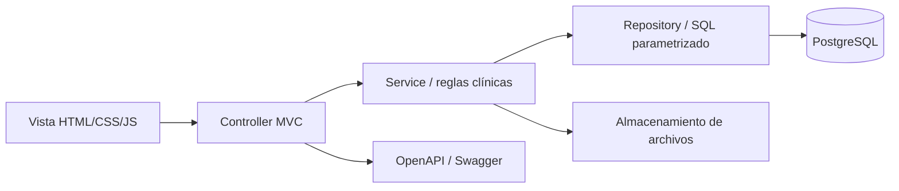

# Arquitectura MVC

HCOP JP usa Spring Boot 4, Java 21, Spring MVC y PostgreSQL. Es un monolito
modular: se despliega como una unidad pero cada dominio tiene límites claros.

## Controller

Responsabilidades:

- contrato HTTP;
- conversión de parámetros y JSON;
- permiso requerido;
- código de respuesta;
- delegación al servicio.

No contiene SQL ni decide reglas clínicas complejas.

## Service

Responsabilidades:

- validaciones de negocio;
- transacciones;
- control de estados;
- idempotencia;
- generación de evoluciones y auditoría;
- composición de datos de varios repositorios.

Ejemplos: `TreatmentService`, `InfusionService`, `TreatmentWorkflowService`.

## Repository

Responsabilidades:

- consultas parametrizadas;
- mapeo fila/objeto;
- control optimista por `revision`;
- operaciones atómicas;
- ninguna dependencia de la interfaz.

## View

La interfaz está servida como recursos estáticos por el mismo servidor Java.
Esto evita dos aplicaciones pegadas, CORS y duplicación de login. Todos los
`fetch("/api/...")` llegan al mismo origen y usan la cookie de sesión.

## Módulos

- `auth` y `admin`;
- `patient` y `diagnosis`;
- `treatment`, `workflow`, `infusion`, `qr`;
- `configuration` y `catalog`;
- `media`;
- `integration`;
- `system`.

Las dependencias apuntan hacia servicios/repositories; ningún módulo vuelve a
Node.js ni a Lira.
